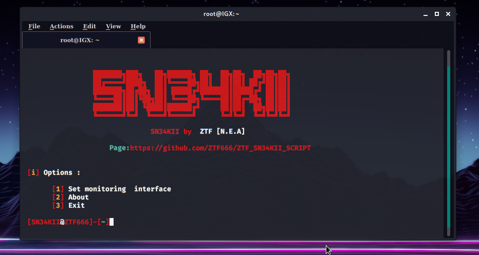
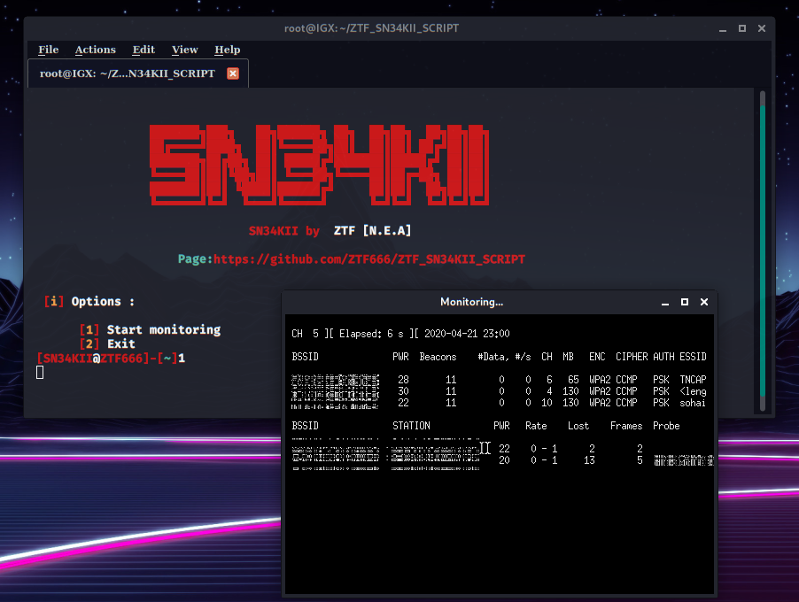
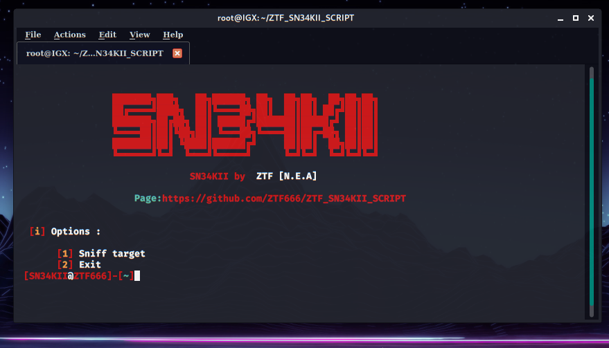
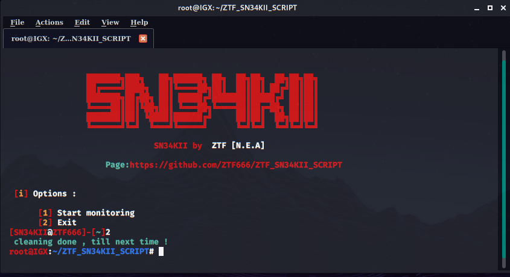
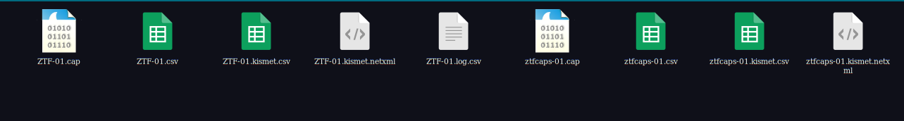

# ZTF_SN34KII_SCRIPT
:ear: :eyes: :nose: :computer: :floppy_disk: :zap: :whale: :book:  and voila ! 


## What does the script do !?
```
Sniff packets from wlan without having access .
This tool needs wireshark and the networks password to decrypt the .caps files .

```
## Prerequisite

```
Kali linux or parrotOs & wireshark
if else 
get airmon-ng and you'll be fine
```
## Starting monitoring interface
``` 
Starts monitor mode
```


## Selecting & sniffing Target
```
After closing the xterm and noting your target's info,
you're prompted to this
```

```
Type in 1 and you'll be prompted to insert the data . 
```


## Capturing the packets
```
When the Essid , Bssid , channel and the name of your .cap files are done being inserted , 
on new terminal will open and start sniffing the target
```


- **My issue**
<details>
  <p>Since i'm using my secondary wifi dongle</p>
  <p>My monitoring interface tends to crash and bugs out that's why  </p>
  <p>I wasn't able to show a screenshot of the capture</p>
  <p>It's bugged out on capturing the handshake.</p>
  <p>So please use a good wifi dongle or the built in wifi card.</p>
</details>

## Cleaning interface
```
Once you chose the EXIT option , the script will close the monitoring interface.
If by mistake you close the script use these commands to close your monitoring interface :
```

```Shell
ifconfig -a 
airmon-ng stop YOUR_MONITOR_INTERFACE
airmon-ng check kill 
```


## .cap files
```
If you don't specify a path , they will be created in same folder as the script .
```


## How to Read the CAP
```
Wireshark is your friend !
And you need the password to the network , in case you don't fluxion maybe helpful .
I have my own modified version of old fluxion before it was taken down and it's always good to use.
```
## Credits & Support

```
I made this a couple of years ago so it may not be top notch  lol .
If you wanna add something to it contact me and let's make it happen.
```
## Contact me

```
you can contact me at ZTF666@protonmail.ch or via my portfolio
```

- **:alien:** [Portfolio](https://ztfportfolio.web.app/) **:alien:**

```
Made with 💘 by a 👨‍💻 on a 💻 | 2018-2020 | ZTF666
```
